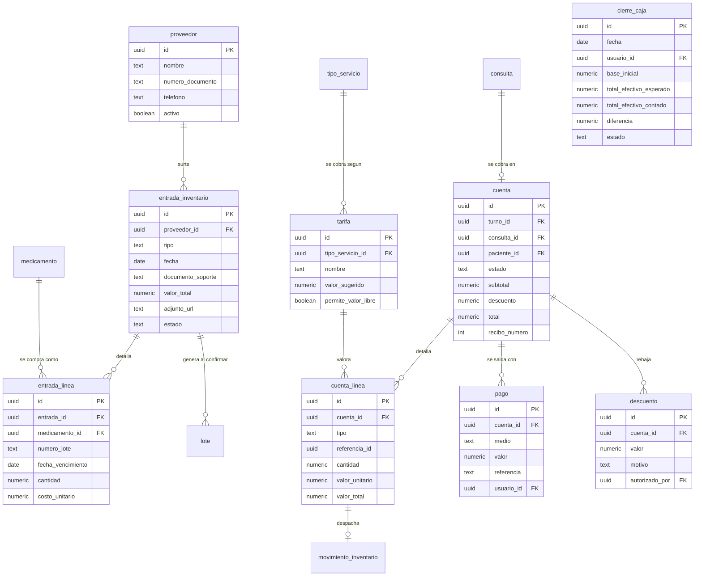

# Modelo de datos — Chasqui Pet

Este documento refleja el esquema **realmente implementado** en `db/migrations/`
(pasos 1 a 4 del plan de implementación) y, aparte, el modelo **previsto** para
los pasos 5 y 6, tal como está especificado en `chasquipet.md`.

---

## 1. Implementado hoy

```mermaid
erDiagram
    sede ||--o{ consultorio : "tiene"
    sede ||--o{ usuario : "adscribe"
    sede ||--o{ turno : "recibe"

    consultorio ||--o{ sesion_consultorio : "abre"
    consultorio ||--o{ turno : "atiende"

    usuario ||--o{ usuario_rol : "cumple"
    usuario ||--o{ usuario_permiso : "recibe excepcion"
    usuario ||--o{ sesion : "inicia"
    usuario ||--o{ sesion_consultorio : "ocupa"
    usuario ||--o{ turno : "atiende como veterinario"
    usuario ||--o{ conversacion_estado : "conversa"
    usuario ||--o{ auth_challenge : "aprueba"

    rol ||--o{ usuario_rol : "se asigna"
    rol ||--o{ rol_permiso : "agrupa"
    permiso ||--o{ rol_permiso : "pertenece"
    permiso ||--o{ usuario_permiso : "se otorga o revoca"

    tipo_servicio ||--o{ turno : "clasifica"
    turno ||--o{ aviso_turno_enviado : "notifica"

    medicamento ||--o{ lote : "se almacena en"
    medicamento ||--o{ movimiento_inventario : "se consume como"
    lote ||--o{ movimiento_inventario : "registra"
    turno ||--o{ movimiento_inventario : "justifica"
    usuario ||--o{ movimiento_inventario : "despacha"

    dueno ||--o{ paciente : "tiene"
    dueno ||--o{ turno : "acompana"
    paciente ||--o{ turno : "ocupa"
    paciente ||--o{ consulta : "recibe"
    paciente ||--o{ movimiento_inventario : "consume"
    consulta ||--o{ movimiento_inventario : "justifica"
    consulta ||--o{ consulta_adenda : "se corrige con"
    turno ||--o| consulta : "origina"
    cita ||--o| consulta : "origina"
    cita ||--o| turno : "se convierte en"
    tipo_servicio ||--o{ cita : "clasifica"
    usuario ||--o{ consulta : "firma"
    usuario ||--o{ disponibilidad : "atiende en"

    sede {
        uuid id PK
        text nombre
        text ciudad
        text direccion
        boolean activa
    }

    consultorio {
        uuid id PK
        uuid sede_id FK
        text nombre
        int orden
        boolean activo
    }

    usuario {
        uuid id PK
        bigint telegram_user_id UK
        bigint telegram_chat_id
        text nombre_completo
        uuid sede_id FK
        uuid creado_por FK
        boolean activo
    }

    rol {
        text codigo PK
        text nombre
        int nivel
        boolean sistema
    }

    permiso {
        text codigo PK
        text modulo
        text descripcion
    }

    rol_permiso {
        text rol_codigo PK,FK
        text permiso_codigo PK,FK
    }

    usuario_rol {
        uuid usuario_id PK,FK
        text rol_codigo PK,FK
        uuid asignado_por FK
    }

    usuario_permiso {
        uuid usuario_id PK,FK
        text permiso_codigo PK,FK
        boolean otorgado
        text motivo
    }

    tipo_servicio {
        uuid id PK
        text codigo UK
        text nombre
        char prefijo
        int prioridad_base
        boolean visible_qr
    }

    turno {
        uuid id PK
        text codigo
        uuid sede_id FK
        date fecha
        int numero_secuencial
        uuid tipo_servicio_id FK
        text estado
        int prioridad
        text canal_origen
        bigint telegram_chat_id
        uuid consultorio_id FK
        uuid veterinario_id FK
        uuid dueno_id "sin FK todavia"
        uuid paciente_id "sin FK todavia"
        uuid consulta_id "sin FK todavia"
        uuid cuenta_id "sin FK todavia"
        int veces_llamado
        int veces_reencolado
    }

    sesion_consultorio {
        uuid id PK
        uuid consultorio_id FK
        uuid usuario_id FK
        timestamptz abierta_at
        timestamptz cerrada_at
    }

    medicamento {
        uuid id PK
        text nombre_generico
        text nombre_comercial
        text principio_activo
        text presentacion
        text unidad_base
        boolean requiere_receta
        numeric precio_venta
        numeric stock_minimo
        text busqueda "generada, indice trigram"
        boolean activo
    }

    lote {
        uuid id PK
        uuid medicamento_id FK
        text numero_lote
        date fecha_vencimiento
        numeric cantidad_inicial
        numeric cantidad_actual "cache del trigger"
        numeric costo_unitario
        uuid entrada_id "sin FK todavia"
        boolean bloqueado
        text motivo_bloqueo
    }

    movimiento_inventario {
        bigint id PK
        uuid lote_id FK
        uuid medicamento_id FK
        text tipo
        numeric cantidad
        text motivo
        uuid turno_id FK
        uuid consulta_id "sin FK todavia"
        uuid paciente_id "sin FK todavia"
        uuid cuenta_linea_id "sin FK todavia"
        uuid usuario_id FK
        text canal
    }

    aviso_turno_enviado {
        uuid turno_id PK,FK
        text tipo PK
        timestamptz enviado_at
    }

    conversacion_estado {
        bigint chat_id PK
        uuid usuario_id FK
        text flujo
        text paso
        jsonb datos
        timestamptz expira_at
    }

    sesion {
        uuid id PK
        uuid usuario_id FK
        text token_hash UK
        text device_name
        inet ip
        timestamptz expires_at
        boolean revocada
    }

    auth_challenge {
        uuid id PK
        char codigo
        text estado
        int intentos
        uuid usuario_id FK
        uuid sesion_id
        timestamptz expira_at
    }

    config {
        text clave PK
        text valor
        text tipo
        text descripcion
        boolean editable_ui
    }

    evento_auditoria {
        bigint id PK
        text entidad
        text entidad_id
        text accion
        uuid usuario_id
        text canal
        jsonb datos_antes
        jsonb datos_despues
    }

    telegram_update {
        bigint update_id PK
        bigint telegram_user_id
        bigint chat_id
        jsonb payload
        boolean procesado
    }

    tarea_async {
        bigint id PK
        text tipo
        jsonb payload
        text estado
        int intentos
        int max_intentos
        timestamptz proxima_ejecucion
        text ultimo_error
        text clave_unicidad
    }

    rate_limit {
        text clave PK
        timestamptz ventana_at
        int conteo
    }

    dueno {
        uuid id PK
        text nombre_completo
        text telefono
        text telefono_digitos
        text tipo_documento
        text numero_documento
        bigint telegram_chat_id
        text direccion
        text barrio
        boolean consentimiento_datos
        timestamptz consentimiento_fecha
        boolean activo
    }

    paciente {
        uuid id PK
        uuid dueno_id FK
        text nombre
        text especie
        text raza
        text sexo
        boolean esterilizado
        date fecha_nacimiento_aprox
        text color_senas
        numeric peso_ultimo_kg
        text alergias
        text estado
    }

    consulta {
        uuid id PK
        uuid turno_id FK
        uuid cita_id FK
        uuid paciente_id FK
        uuid dueno_id FK
        uuid veterinario_id FK
        uuid consultorio_id FK
        date fecha
        text motivo_consulta
        text anamnesis
        jsonb examen_fisico
        text diagnostico_presuntivo
        text diagnostico_definitivo
        text plan_tratamiento
        text recomendaciones
        text remision_externa
        date proxima_revision
        text estado
        timestamptz firmada_at
    }

    consulta_adenda {
        bigint id PK
        uuid consulta_id FK
        text texto
        uuid usuario_id FK
        timestamptz created_at
    }

    cita {
        uuid id PK
        uuid sede_id FK
        uuid paciente_id FK
        uuid tipo_servicio_id FK
        uuid veterinario_id FK
        uuid turno_id FK
        timestamptz inicio_at
        timestamptz fin_at
        text estado
    }

    disponibilidad {
        uuid id PK
        uuid veterinario_id FK
        uuid consultorio_id FK
        int dia_semana
        time hora_inicio
        time hora_fin
    }
```

| Entidad | Para qué sirve |
|---|---|
| `sede` | La clínica. El modelo admite varias desde el principio para no reescribirlo después. |
| `consultorio` | Cada uno de los dos consultorios donde se atiende. |
| `usuario` | Personal de la clínica. Se identifica por su `telegram_user_id`; nadie se autoregistra. |
| `rol` / `permiso` / `rol_permiso` | El sistema de autorización, guardado como datos. |
| `usuario_rol` | Qué roles tiene cada persona. |
| `usuario_permiso` | Excepciones individuales: el auxiliar al que el admin le habilita descuentos o entradas. |
| `tipo_servicio` | Consulta general, vacunación, control, urgencia. Define el prefijo del turno y su prioridad base. |
| `turno` | El turno de un paciente en la cola del día. Es la entidad central del paso 2. |
| `sesion_consultorio` | Qué veterinario está en qué consultorio en este momento. |
| `dueno` | Quién trae al animal. Sólo el nombre es obligatorio: exigir documento frena la atención. |
| `paciente` | El animal. Puede no tener dueño registrado —un callejero se atiende igual. |
| `consulta` | El registro clínico. Nace como borrador y sólo vale cuando se firma. |
| `consulta_adenda` | Correcciones posteriores a la firma. De sólo agregar: lo firmado no se reescribe. |
| `cita` / `disponibilidad` | Agendamiento. **Fuera del MVP** (§3): las tablas existen para que un turno y una cita converjan en la misma `consulta`, pero nada las expone todavía. |
| `medicamento` | El catálogo, con el precio de venta y el mínimo por debajo del cual hay que pedir. |
| `lote` | La existencia física de un medicamento, con su vencimiento y el costo al que entró. |
| `movimiento_inventario` | Cada entrada, salida, ajuste o baja. Inmutable: es la fuente de verdad del stock. |
| `aviso_turno_enviado` | Memoria de qué avisos de Telegram ya se mandaron, para no repetirlos en cada pasada del worker. |
| `conversacion_estado` | Dónde va cada conversación del bot. Vive aquí para que n8n no guarde estado. |
| `sesion` | Sesiones abiertas del portal web, revocables una a una. |
| `auth_challenge` | Intento de inicio de sesión web pendiente de aprobación desde Telegram. |
| `config` | Parámetros operativos editables desde el portal, sin desplegar código. |
| `evento_auditoria` | Registro inmutable de quién hizo qué. |
| `telegram_update` | Todos los updates recibidos, con `update_id` como llave, para descartar los repetidos. |
| `tarea_async` | La cola de trabajo diferido, con reintentos y bandeja de fallidas. |
| `rate_limit` | Contadores de límite de uso, sin estado en la aplicación. |

### Las columnas sin llave foránea

`turno.cuenta_id`, `movimiento_inventario.cuenta_linea_id` y `lote.entrada_id`
existen ya como `uuid`, pero todavía **no** tienen `REFERENCES`: las tablas a las
que apuntan se crean en los pasos 5 y 6. Están declaradas desde ahora para que
los módulos de turnos e inventario no haya que tocarlos cuando lleguen — la misma
razón por la que `chasquipet.md` §3 pide modelar las citas sin implementarlas.
Las llaves foráneas se añaden con `ALTER TABLE` en las migraciones de esos pasos,
igual que `050_pacientes.sql` acaba de hacer con `turno.dueno_id`,
`turno.paciente_id`, `turno.consulta_id`, `movimiento_inventario.consulta_id` y
`movimiento_inventario.paciente_id`.

Desde el paso 4, una salida de medicamento queda atada a la visita
(`movimiento_inventario.turno_id`), al animal y a la consulta. El flujo de salida
no cambió para conseguirlo: `salida_medicamento()` lee el turno que el
veterinario tiene en atención y copia de ahí `paciente_id` y `consulta_id`.

---

## 2. Pendiente (pasos 5 y 6 del plan)

Modelo previsto según `chasquipet.md` §7.1 y §9. **Todavía no existe en la base
de datos.** `medicamento`, `lote`, `movimiento_inventario`, `consulta`, `turno` y
`paciente` aparecen aquí sólo como referencia de las relaciones que les faltan
por conectar.

| Entidad | Para qué servirá | Paso |
|---|---|---|
| `tarifa` | Cuánto vale cada servicio. | 5 |
| `cuenta` / `cuenta_linea` | La cuenta de la atención y su detalle. | 5 |
| `descuento` / `pago` | Rebajas justificadas y dinero recibido. | 5 |
| `cierre_caja` | Cuadre del efectivo al final del día. | 5 |
| `proveedor` / `entrada_inventario` / `entrada_linea` | Compras que ingresan mercancía. | 6 |

---

## 3. Decisiones del modelo

**El stock se deriva de los movimientos, no se guarda como un número.**
`lote.cantidad_actual` existe, pero es un caché mantenido por trigger: la verdad
son las filas de `movimiento_inventario`. Un número suelto que se suma y se resta
acaba desviándose de la realidad y no hay forma de saber cuándo pasó ni por qué.
Con los movimientos siempre se puede reconstruir la existencia de cualquier lote
en cualquier fecha, y responder la pregunta que importa cuando hay un retiro de
producto del mercado: qué pacientes recibieron ese lote.

**Los movimientos y la auditoría son de sólo agregar.**
El rol de base de datos con el que se conectan n8n, el worker y el portal no tiene
`UPDATE` ni `DELETE` sobre `movimiento_inventario` ni sobre `evento_auditoria` —
eso está en `db/migrations/090_grants.sql`, no es una convención que dependa de
que el código se porte bien. Corregir un error se hace con un movimiento inverso,
que también queda registrado. Una auditoría que la aplicación puede borrar no
sirve de nada, y aquí hay dinero e inventario de por medio.

**Los permisos son datos, no código.**
Quién puede hacer qué vive en las tablas `rol`, `permiso`, `rol_permiso`,
`usuario_rol` y `usuario_permiso`. Habilitarle descuentos a un auxiliar es un
`INSERT`, no un despliegue. Esto sostiene además la separación de funciones que
exige el negocio: quien despacha el medicamento (el veterinario) no es quien
recibe el dinero (el auxiliar), y esa regla es verificable mirando una tabla.

**La numeración de turnos usa un advisory lock.**
`MAX(numero)+1` parece obvio y falla: en un día pico de 100 pacientes, con turnos
entrando por el QR y por recepción al mismo tiempo, dos transacciones leen el
mismo máximo y emiten el mismo número. `siguiente_numero_turno()` toma primero
`pg_advisory_xact_lock` sobre la pareja (sede, fecha), así que los emisores del
mismo día se serializan entre sí y no bloquean nada más. Por la misma razón,
`llamar_siguiente()` selecciona con `FOR UPDATE SKIP LOCKED`: si los dos
veterinarios pulsan «Llamar siguiente» en el mismo instante, cada uno se lleva un
turno distinto en vez de que uno espere o de que ambos se lleven el mismo.

**FEFO se sugiere y se puede desobedecer, pero no en silencio.**
Al despachar, el bot elige el lote de vencimiento más próximo y ni siquiera
pregunta: es lo correcto casi siempre y ahorra un toque. Usar otro lote es
posible —a veces el frasco abierto es el otro— pero `salida_medicamento()`
devuelve `fefo_sin_justificacion` hasta que se escriba un motivo, que queda en
el movimiento. Prohibirlo obligaría al veterinario a mentir en el registro; no
pedir nada haría que las mermas por vencimiento no tuvieran explicación.

**El bot se extiende por enganches, no reescribiendo el enrutador.**
`bot_manejar_update()` vive en `040_bot_turnos.sql` porque turnos fue el primer
módulo, pero inventario, historia clínica y cobro también necesitan botones en el
menú y sus propios callbacks. En vez de copiar el enrutador entero en cada
migración —que es como acaban desincronizándose— ese archivo declara tres
funciones vacías (`bot_menu_extra`, `bot_modulo_callback`, `bot_modulo_texto`) que
las migraciones siguientes reemplazan.

Cada módulo escribe las suyas con su propio prefijo (`bot_inv_*`, `bot_cli_*`,
`bot_auth_*`) y devuelve `NULL` cuando lo que llegó no es suyo. Las tres
funciones de enganche quedan reducidas a un despachador de cinco líneas que las
encadena con `COALESCE`, y que la migración de cada módulo nuevo vuelve a
escribir añadiéndose al final. Así, agregar el módulo clínico no obligó a tocar
una sola línea del flujo de salida de medicamento.

**La consulta se guarda a medias y sólo vale cuando se firma.**
Cada respuesta del chat se persiste al instante en `consulta`, en estado
`borrador` (§8.2.3). El estado conversacional vive aparte, en
`conversacion_estado`: son dos cosas distintas a propósito, porque perder el hilo
de la conversación no puede perder lo que ya se escribió. Al firmar, un trigger
(`consulta_inmutable`) impide cualquier cambio posterior salvo la anulación; lo
que faltó se agrega como `consulta_adenda`, con autor y hora. Es la misma regla
que en inventario: la corrección se añade, no se sobrescribe.

**Lo obligatorio para firmar es el mínimo clínico, no el formulario completo.**
`firmar_consulta()` exige motivo, diagnóstico y tratamiento, y nada más. Todo lo
demás —anamnesis, examen físico, recomendaciones, remisión, próxima revisión— es
opcional y saltable. Un formulario que exige quince campos con el animal en la
mesa se rellena con basura; uno que exige tres se rellena de verdad.

**El examen físico es `jsonb` y sus opciones son una función.**
Los campos del examen cambian con la práctica de cada clínica y no queremos una
migración por cada uno. Lo que sí es estable —el peso— se copia a
`paciente.peso_ultimo_kg` al firmar. Las opciones de lo enumerable (mucosas,
hidratación, condición corporal, especie, sexo) viven en `opciones_examen()`, que
consumen tanto los botones del bot como el `<select>` del portal: una sola
definición, dos interfaces que no pueden discrepar.

**El portal no tiene usuarios propios.**
La identidad es la de Telegram, que ya está aprovisionada y con permisos (§4).
Entrar al portal es pedir un código de seis dígitos, confirmarlo en el bot y
canjearlo por una sesión (`058_auth_web.sql`). El token viaja una sola vez y en
`sesion` sólo queda su `sha256`, así que una copia de esa tabla no permite entrar
a nadie. Esto se adelantó al paso 4 —el resto del portal es el paso 7— porque el
formulario web de consulta es historia clínica y no podía quedar abierto en la
red local.
